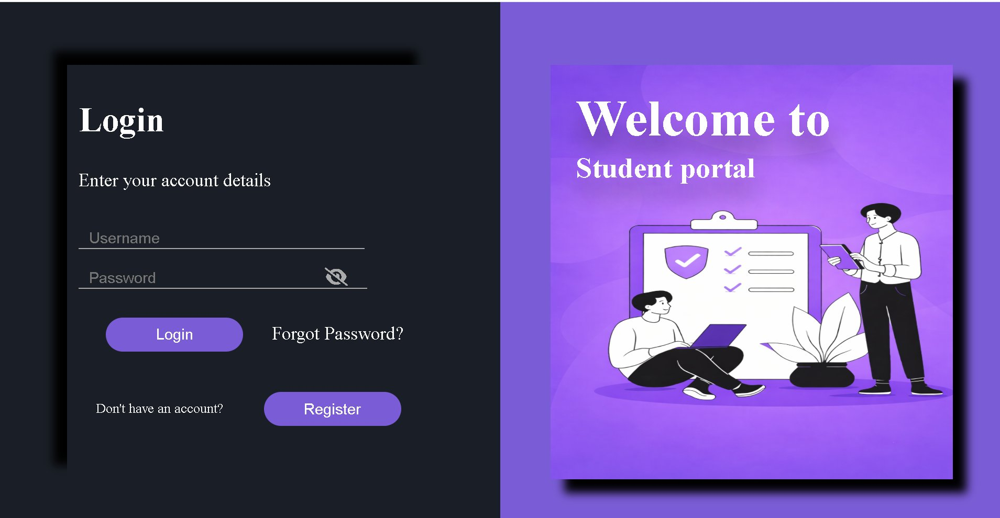
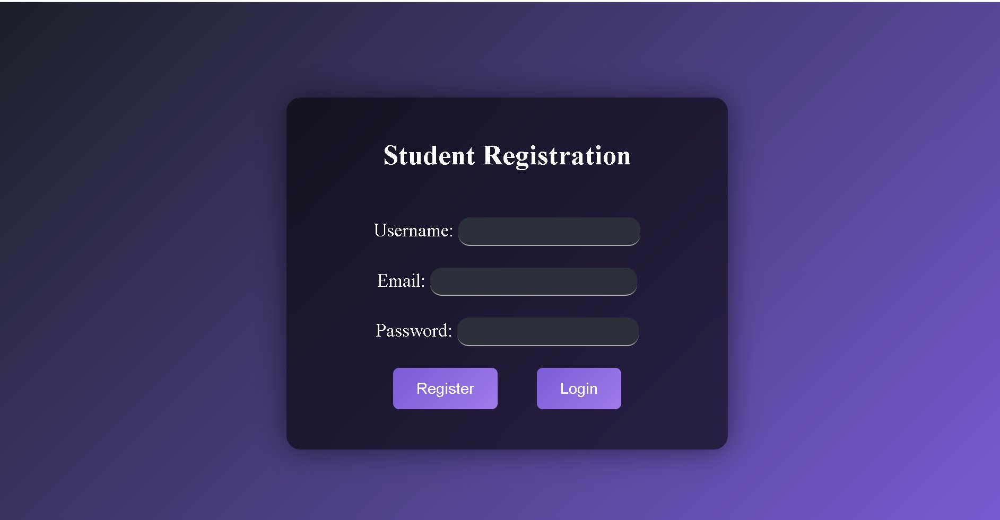
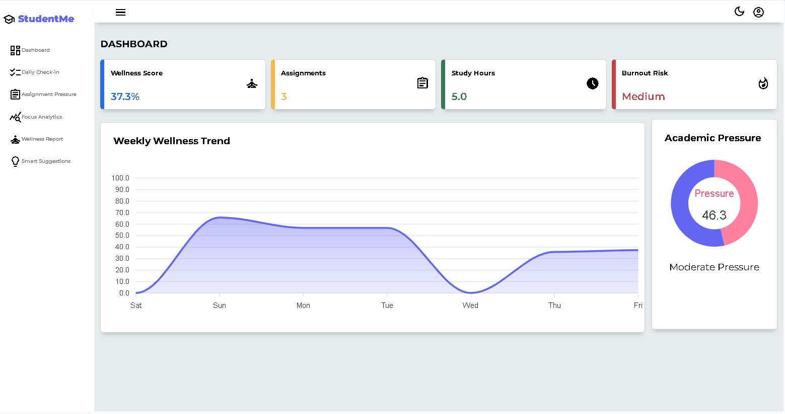
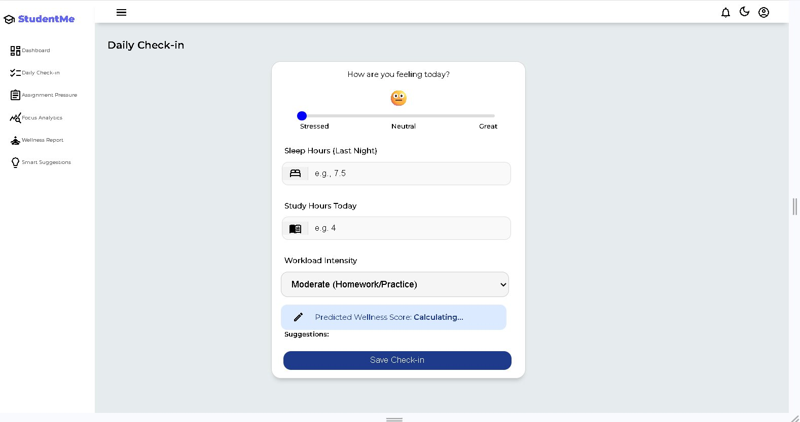
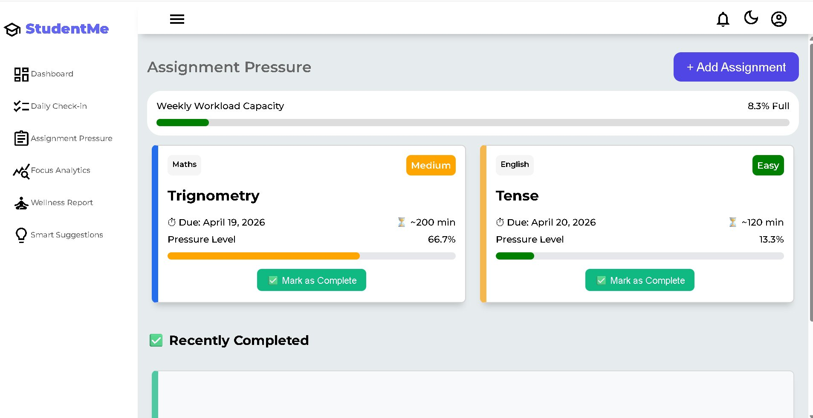
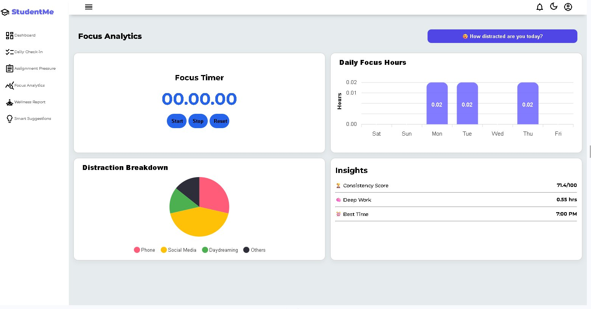
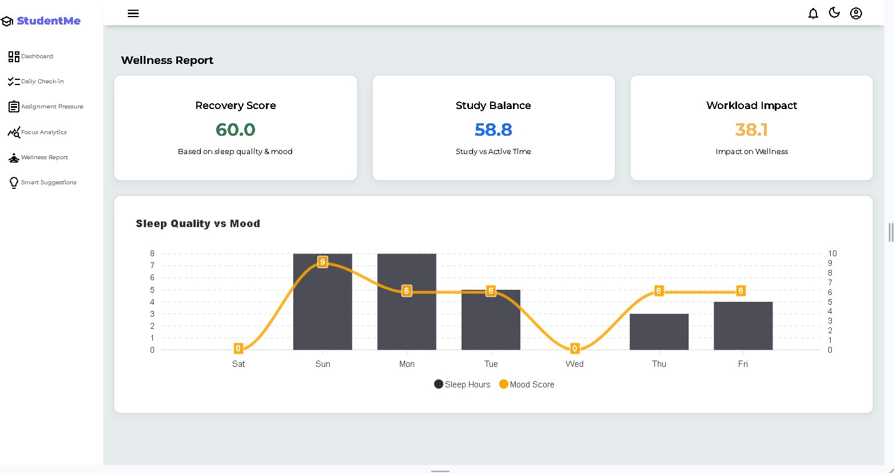
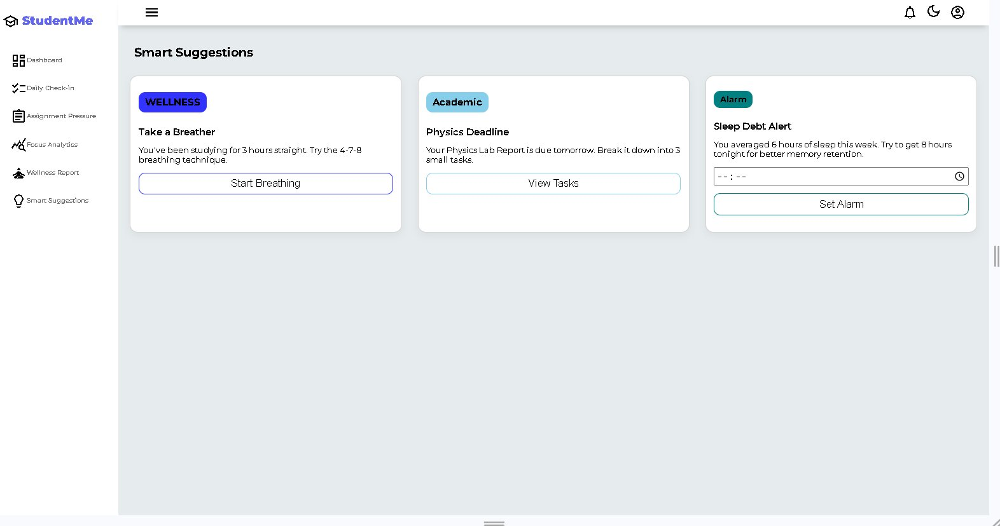

# 🧠 Student Mental Health & Academic Pressure Analytics Platform


> A data-driven web platform to monitor student mental health and academic pressure in real time.

---

## 📌 Table of Contents

- [Overview](#-overview)
- [Problem Statement](#-problem-statement)
- [Solution](#-solution)
- [Screenshots](#-screenshots)
- [Key Features](#-key-features)
- [Tech Stack](#-tech-stack)
- [Analytics and Formulas](#-analytics--formulas)
- [Smart Suggestions](#-smart-suggestions)
- [Project Structure](#-project-structure)
- [Installation and Setup](#-installation--setup)
- [Future Scope](#-future-scope)
- [Author](#-author)

---

## 🌟 Overview

**StudentMe** is a web-based platform that helps students track, analyze, and improve their mental well-being alongside academic performance.

Instead of guesswork, the platform uses **real data + analytics formulas** to generate:

- A personalized **Wellness Score**
- **Burnout Risk** detection
- **Academic Pressure Level**
- **Smart Personalized Recommendations**

> This is not just a CRUD app — it is a data analytics platform built for a real EdTech use case.

---

## 😟 Problem Statement

Students today face multiple challenges that go untracked:

| Problem | Impact |
|---|---|
| High academic pressure | Anxiety, poor performance |
| Poor sleep cycles | Low focus, health issues |
| Irregular study patterns | Burnout, low productivity |
| Assignment overload | Stress, missed deadlines |
| No monitoring system | Problems go undetected |

There was no simple unified system to track all these factors together and provide actionable insights.

---

## 💡 Solution

This platform collects daily student data and converts it into meaningful insights:

```
Student fills daily check-in
        ↓
Data stored in database
        ↓
Backend processes data with formulas
        ↓
Dashboard shows Wellness Score, Burnout Risk, Pressure Level, Charts
        ↓
Smart Suggestions generated
        ↓
Student makes better decisions
```

---

## 🖼️ Screenshots

### 🔐 Login Page


---

### 📝 Registration Page


---

### 🏠 Dashboard


Wellness Score, Weekly Trend Chart, Burnout Risk, and Academic Pressure — all in one view.

---

### ✅ Daily Check-in


Student enters mood, sleep hours, study hours, and workload intensity. Live wellness score is calculated instantly.

---

### 📚 Assignment Pressure


Track assignments with deadlines, difficulty levels, estimated time, and per-assignment pressure bars.

---

### ⏱️ Focus Analytics


Focus Timer, Distraction Breakdown Pie Chart, Weekly Deep Work Chart, and Smart Insights.

---

### 📊 Wellness Report


Recovery Score, Study Balance, Workload Impact, and Sleep Quality vs Mood chart.

---

### 💬 Smart Suggestions


Personalized wellness, academic, and sleep recommendations based on student data.

---

## 🔑 Key Features

### 🏠 Dashboard
- Overall Wellness Score (0-100)
- 7-day wellness trend chart
- Burnout Risk label — Low / Medium / High
- Academic Pressure donut chart with score
- Total assignments and study hours overview

### ✅ Daily Check-in
- Mood slider — Stressed to Great
- Enter sleep hours, study hours, workload intensity
- Instant Predicted Wellness Score
- Personalized suggestions on submit

### 📚 Assignment Pressure Tracker
- Add assignments with subject, title, due date, difficulty, and estimated time
- Per-assignment Pressure Level bar
- Mark assignments as complete
- Auto-deletes overdue incomplete assignments
- Weekly Workload Capacity progress bar

### ⏱️ Focus Analytics
- Built-in Focus Timer with Start, Stop, Reset
- Track distractions — Phone, Social Media, Daydreaming, Others
- Distraction Breakdown pie chart
- Weekly Daily Focus Hours bar chart
- Insights: Consistency Score, Deep Work Hours, Best Study Time

### 📊 Wellness Report
- Recovery Score based on sleep and mood
- Study Balance Score — focus vs distraction ratio
- Workload Impact Score
- Weekly Sleep Quality vs Mood combo chart

### 💬 Smart Suggestions
- Wellness card — Breathing exercise using 4-7-8 technique
- Academic card — Upcoming deadline alert with task breakdown
- Sleep Debt Alert with alarm setter
- All cards are condition-based and personalized

---

## 🛠️ Tech Stack

| Layer | Technology |
|---|---|
| Frontend | HTML5, CSS3, JavaScript |
| Charts | ApexCharts.js |
| Backend | Django (Python) |
| Database | SQLite |
| Authentication | Django Built-in Auth |

---

## 🧮 Analytics & Formulas

### Wellness Score
```python
vv = (sleep_hours * 0.4) + (study_hours * 0.3) - (workload * 0.3)
wellness_score = round((vv / 6.7) * 100, 1)
```
Sleep carries 40% weight, study contributes 30% positively, workload reduces the score by 30%.

---

### Academic Pressure Score
```python
pressure_score = (capacity * 0.4) + ((100 - wellness_score) * 0.6)
# Below 40  = Low Pressure
# 40 to 70  = Moderate Pressure
# Above 70  = High Pressure
```

---

### Recovery Score
```python
# Sleep: less than 3 hrs = 30 | 3 to 6 hrs = 60 | 6+ hrs = 90
# Mood:  sad = 30 | okay = 60 | happy = 90
recovery_score = (sleep_score * 0.6) + (mood_score * 0.4)
```

---

### Study Balance
```python
study_balance = ((focus_time + study_time) / total_active) * 100
```

---

### Weekly Workload Capacity
```python
total_minutes = sum(task.estimated_time for task in weekly_tasks)
capacity = min((total_minutes / 2400) * 100, 100)
```

---

### Best Study Time Detection
```python
from collections import Counter
most_common_hour = Counter(hour_list).most_common(1)[0][0]
```

---

## 💬 Smart Suggestions

| Condition | Suggestion |
|---|---|
| Sleep < 6 hrs | Sleep 7-8 hours tonight, recovery is essential |
| Stress = High | Try deep breathing or a 10-minute walk |
| Workload > 80% | Postpone some tasks or ask for help |
| Mood = Sad | Talk to a friend, do not stay alone |
| Focus < 30% | Switch off phone, try the Pomodoro technique |
| Wellness < 40 | Study lightly today, prioritize self-care |

---

## 📁 Project Structure

```
student-portal/
│
├── student_app/
│   ├── models.py
│   ├── views.py
│   ├── urls.py
│   └── templates/
│       ├── dashboard.html
│       ├── check-in.html
│       ├── assignment-pressure.html
│       ├── focus-analytics.html
│       ├── wellness-report.html
│       ├── smart-suggestions.html
│       ├── login.html
│       └── register.html
│
├── screenshots/
│   ├── Login.png
│   ├── Registration.png
│   ├── Dashboard.png
│   ├── Check-in_.png
│   ├── Assignment_Pressure.png
│   ├── Focus_Analytics.png
│   ├── Wellness_Report.png
│   └── Smart_Suggestions.png
│
├── db.sqlite3
├── manage.py
└── README.md
```

---

## 🚀 Installation & Setup

```bash
# 1. Clone the repository
git clone https://github.com/kiranpreet6862/student-portal.git
cd student-portal

# 2. Create virtual environment
python -m venv venv
source venv/bin/activate
# On Windows: venv\Scripts\activate

# 3. Install dependencies
pip install -r requirements.txt

# 4. Apply migrations
python manage.py makemigrations
python manage.py migrate

# 5. Run the server
python manage.py runserver

```

Open in browser: `http://127.0.0.1:8000/`

---

## 🔮 Future Scope

- [ ] Mobile App using React Native
- [ ] ML model to predict burnout 3 days in advance
- [ ] Wearable device integration for auto sleep tracking
- [ ] Teacher dashboard for college-level monitoring
- [ ] Push notifications for daily check-in reminders
- [ ] PostgreSQL for production database

---

## 🌟 Why This Project Is Unique

- Combines mental health and academics — rare in EdTech
- Data analytics approach, not just CRUD
- Real-world problem solving with preventive care mindset
- Scalable to college-wide or mobile deployment
- Formula-based intelligence, not just storing and displaying data

---

## 👨‍💻 Author

**Kiranpreet**

[](https://github.com/kiranpreet6862)

---

⭐ If you found this project helpful, please give it a star!

Made with ❤️ to help students manage stress and study smarter.
